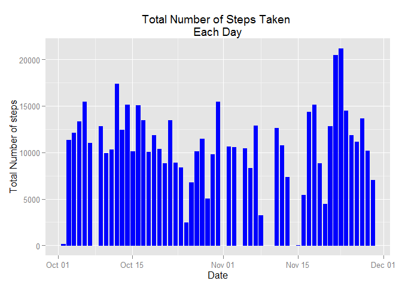
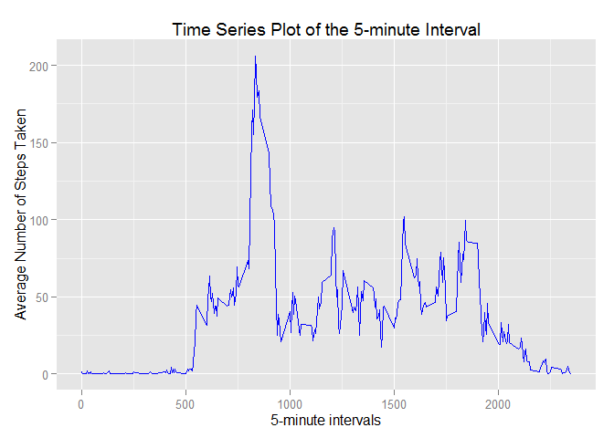
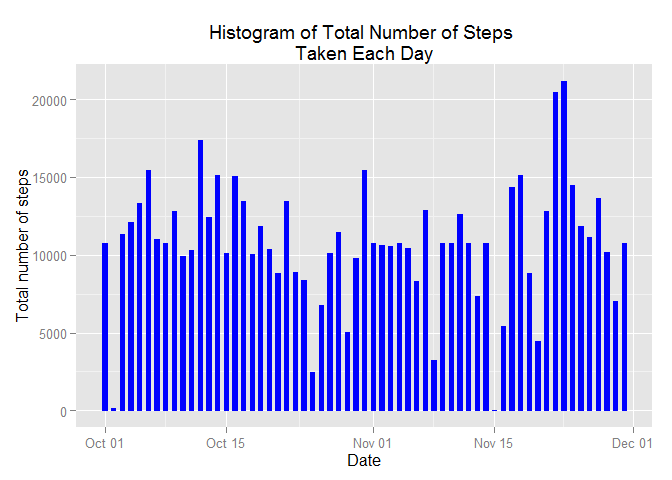

#Reproducible Research: Peer Assessment 1

## Basic settings and library reference

```r
# Make code visible by default
echo = TRUE  
# reference libraries to be used through code
library(ggplot2)
library(lattice)
```

## Loading and preprocessing the data
###1.Load the data

```r
#Setting the URL and download the file
setInternet2(use = TRUE) #if on windows 7
url<-"https://d396qusza40orc.cloudfront.net/repdata%2Fdata%2Factivity.zip"
download.file(url,"activity.zip")
#uncompress the downloaded file
unzip("activity.zip")
```
###2.Process/transform the data (if necessary) into a format suitable for your analysis

```r
dt <- read.csv("activity.csv", colClasses = c("integer", "Date", "factor"))
dt$month <- as.numeric(format(dt$date, "%m"))
dtNoNA <- na.omit(dt) #data with no missing values
```

## What is mean total number of steps taken per day?
###For this part of the assignment, missing values are ignored in the dataset.  
###1.Calculate the total number of steps taken per day

```r
stepsPerDay <- aggregate(dtNoNA$steps, list(Date = dtNoNA$date), FUN = "sum")
print(stepsPerDay)
```

```
##          Date     x
## 1  2012-10-02   126
## 2  2012-10-03 11352
## 3  2012-10-04 12116
## 4  2012-10-05 13294
## 5  2012-10-06 15420
## 6  2012-10-07 11015
## 7  2012-10-09 12811
## 8  2012-10-10  9900
## 9  2012-10-11 10304
## 10 2012-10-12 17382
## 11 2012-10-13 12426
## 12 2012-10-14 15098
## 13 2012-10-15 10139
## 14 2012-10-16 15084
## 15 2012-10-17 13452
## 16 2012-10-18 10056
## 17 2012-10-19 11829
## 18 2012-10-20 10395
## 19 2012-10-21  8821
## 20 2012-10-22 13460
## 21 2012-10-23  8918
## 22 2012-10-24  8355
## 23 2012-10-25  2492
## 24 2012-10-26  6778
## 25 2012-10-27 10119
## 26 2012-10-28 11458
## 27 2012-10-29  5018
## 28 2012-10-30  9819
## 29 2012-10-31 15414
## 30 2012-11-02 10600
## 31 2012-11-03 10571
## 32 2012-11-05 10439
## 33 2012-11-06  8334
## 34 2012-11-07 12883
## 35 2012-11-08  3219
## 36 2012-11-11 12608
## 37 2012-11-12 10765
## 38 2012-11-13  7336
## 39 2012-11-15    41
## 40 2012-11-16  5441
## 41 2012-11-17 14339
## 42 2012-11-18 15110
## 43 2012-11-19  8841
## 44 2012-11-20  4472
## 45 2012-11-21 12787
## 46 2012-11-22 20427
## 47 2012-11-23 21194
## 48 2012-11-24 14478
## 49 2012-11-25 11834
## 50 2012-11-26 11162
## 51 2012-11-27 13646
## 52 2012-11-28 10183
## 53 2012-11-29  7047
```
###2.Make a histogram of the total number of steps taken each day  

```r
ggplot(dtNoNA, aes(date, steps)) + geom_bar(stat = "identity", colour = 
"blue", fill = "blue", width = 0.7) + labs(title = "Total Number of Steps Taken 
Each Day", x = "Date", y = "Total Number of steps")
```

 

###3.Calculate and report the mean and median of the total number of steps taken per day

```r
stepsPerDay2 <- aggregate(dtNoNA$steps, list(Date = dtNoNA$date), FUN = "sum")$x
cat('Mean of the total number of steps taken per day: ',mean(stepsPerDay2))
```

```
## Mean of the total number of steps taken per day:  10766.19
```

```r
cat('Median of the total number of steps taken per day: ',median(stepsPerDay2))
```

```
## Median of the total number of steps taken per day:  10765
```
## What is the average daily activity pattern?
###1.Make a time series plot (i.e. type = "l") of the 5-minute interval (x-axis) and the average number of steps taken, averaged across all days (y-axis)

```r
aSteps <- aggregate(dtNoNA$steps, list(interval = as.numeric(as.character
(dtNoNA$interval))), FUN = "mean")
names(aSteps)[2] <- "mSteps"

ggplot(aSteps, aes(interval, mSteps)) + geom_line(color = "blue", 
size = 0.5) + labs(title = "Time Series Plot of the 5-minute Interval", x = 
"5-minute intervals", y = "Average Number of Steps Taken")
```

 

###2.Which 5-minute interval, on average across all the days in the dataset, contains the maximum number of steps?

```r
m<-aSteps[aSteps$mSteps == max(aSteps$mSteps), ]
cat('The 5-minute interval that contains the maximum number of steps: ',m$interval)
```

```
## The 5-minute interval that contains the maximum number of steps:  835
```

## Imputing missing values
###Note that there are a number of days/intervals where there are missing values (coded as NA). The presence of missing days may introduce bias into some calculations or summaries of the data.
###1.Calculate and report the total number of missing values in the dataset (i.e. the total number of rows with NAs)

```r
cat('Total number of missing values: ',sum(is.na(dt)))
```

```
## Total number of missing values:  2304
```
###2.Devise a strategy for filling in all of the missing values in the dataset. The strategy does not need to be sophisticated. For example, you could use the mean/median for that day, or the mean for that 5-minute interval, etc.
* I will use the mean for that 5-minute interval to fill each NA value in the steps column

###3.Create a new dataset that is equal to the original dataset but with the missing data filled in.

```r
nData <- dt 
for (i in 1:nrow(nData)) {
    if (is.na(nData$steps[i])) {
        nData$steps[i] <- aSteps[which(nData$interval[i] == aSteps$interval),]$mSteps
    }
}

head(nData)
```

```
##       steps       date interval month
## 1 1.7169811 2012-10-01        0    10
## 2 0.3396226 2012-10-01        5    10
## 3 0.1320755 2012-10-01       10    10
## 4 0.1509434 2012-10-01       15    10
## 5 0.0754717 2012-10-01       20    10
## 6 2.0943396 2012-10-01       25    10
```

```r
cat('Number of NA in new dataset: ',sum(is.na(nData)))
```

```
## Number of NA in new dataset:  0
```

###4.Make a histogram of the total number of steps taken each day and Calculate and report the mean and median total number of steps taken per day. Do these values differ from the estimates from the first part of the assignment? What is the impact of imputing missing data on the estimates of the total daily number of steps?

```r
ggplot(nData, aes(date, steps)) + geom_bar(stat = "identity",
                                             colour = "blue",
                                             fill = "blue",
                                             width = 0.5) + labs(title = "Histogram of Total Number of Steps 
Taken Each Day", x = "Date", y = "Total number of steps")
```

 

###Calculate and report the mean and median of the total number of steps taken per day

```r
stepsPerDay3 <- aggregate(nData$steps, list(Date = nData$date), FUN = "sum")$x
cat('Mean of the total number of steps taken per day using old dataset with no NA value: ',mean(stepsPerDay2))
```

```
## Mean of the total number of steps taken per day using old dataset with no NA value:  10766.19
```

```r
cat('Mean of the total number of steps taken per day using dataset with imputed missing value: ',mean(stepsPerDay3))
```

```
## Mean of the total number of steps taken per day using dataset with imputed missing value:  10766.19
```

```r
cat('Median of the total number of steps taken per day using old dataset with no NA value: ',median(stepsPerDay2))
```

```
## Median of the total number of steps taken per day using old dataset with no NA value:  10765
```

```r
cat('Median of the total number of steps taken per day using dataset with imputed missing value:: ',median(stepsPerDay3))
```

```
## Median of the total number of steps taken per day using dataset with imputed missing value::  10766.19
```

###Do these values differ from the estimates from the first part of the assignment? What is the impact of imputing missing data on the estimates of the total daily number of steps?
* Dataset with imputed missing value or the old dataset with no NA value has the same mean for total steps taken per day.
* Dataset with imputed missing value has a higher median for total steps taken per day than the old dataset with no NA value.

## Are there differences in activity patterns between weekdays and weekends?
###For this part the weekdays() function may be of some help here. Use the dataset with the filled-in missing values for this part.
###1.Create a new factor variable in the dataset with two levels - "weekday" and "weekend" indicating whether a given date is a weekday or weekend day.

```r
head(nData)
```

```
##       steps       date interval month
## 1 1.7169811 2012-10-01        0    10
## 2 0.3396226 2012-10-01        5    10
## 3 0.1320755 2012-10-01       10    10
## 4 0.1509434 2012-10-01       15    10
## 5 0.0754717 2012-10-01       20    10
## 6 2.0943396 2012-10-01       25    10
```

```r
nData$weekdays <- factor(format(nData$date, "%A"))
levels(nData$weekdays)
```

```
## [1] "Friday"    "Monday"    "Saturday"  "Sunday"    "Thursday"  "Tuesday"  
## [7] "Wednesday"
```

```r
levels(nData$weekdays) <- list(weekday = c("Monday", "Tuesday","Wednesday","Thursday", "Friday"),
                                 weekend = c("Saturday", "Sunday"))
levels(nData$weekdays)
```

```
## [1] "weekday" "weekend"
```

```r
table(nData$weekdays)
```

```
## 
## weekday weekend 
##   12960    4608
```

###2.Make a panel plot containing a time series plot (i.e. type = "l") of the 5-minute interval (x-axis) and the average number of steps taken, averaged across all weekday days or weekend days (y-axis). See the README file in the GitHub repository to see an example of what this plot should look like using simulated data.

```r
aSteps <- aggregate(nData$steps,list(interval = as.numeric(as.character(nData$interval)), weekdays = nData$weekdays),FUN = "mean")
names(aSteps)[3] <- "mOfSteps"

xyplot(aSteps$mOfSteps ~ aSteps$interval | aSteps$weekdays,layout = c(1, 2), type = "l",xlab = "Interval", ylab = "Number of steps")
```

 
